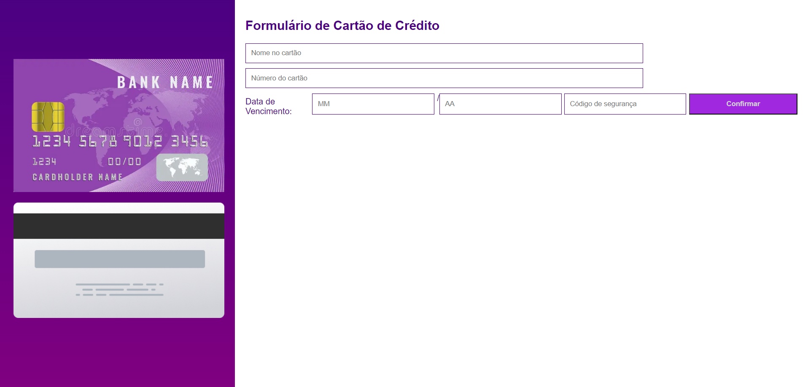
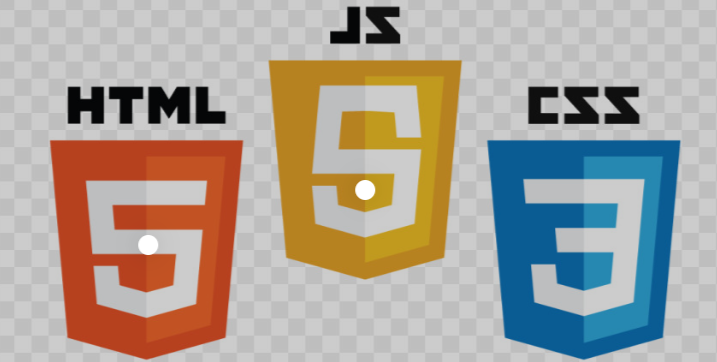

Repositorio interativo de detalhes de cartao.

A página consiste em um cadastro para cartão de crédito, caso o usuário esueça algum campo, aparecerá uma mensagem na tela pedindo que o campo seja preenchido. Após todas a informações solicitadas forem informadas, o usuário clica em confirmar e aparecerá na tela a mensagem de cartão cadastrado com sucesso.

As linguagens de programação utilizadas foram:

https://palomabonattedealmeida.github.io/InteractiveCardDetailsForm/